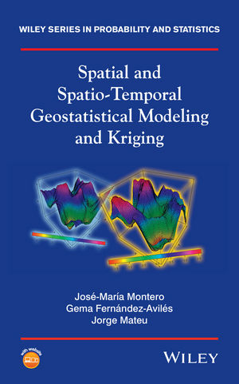
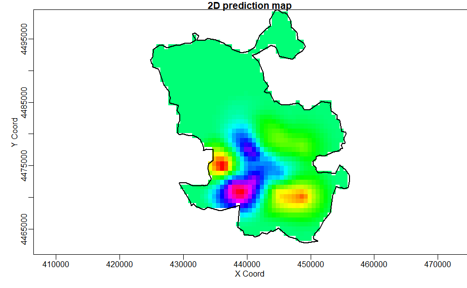
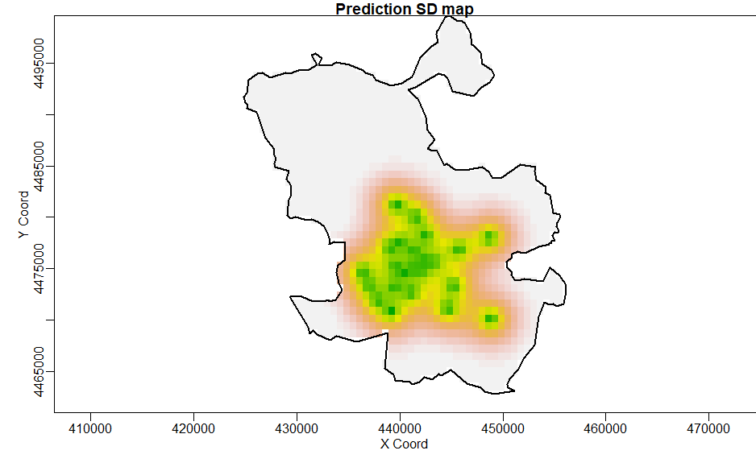
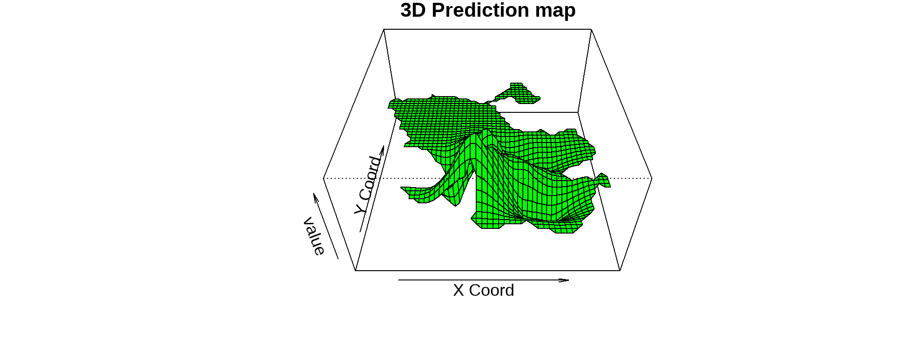

```{r setup, include = FALSE}
# opciones predeterminadas
options(htmltools.dir.version = FALSE)
knitr::opts_chunk$set(
  fig.width=8, fig.height=5, fig.retina=3,
  out.width = "50%",
  out.height="50",
  echo = TRUE,
  message = FALSE, 
  warning = FALSE,
  fig.show = TRUE,
  hiline = TRUE,
  fig.align = "center"
  )

```

---

<center>

</center>  

--- 


# [Pasos de un análisis geoestadístico con `geoR`]{style="color:blue"}


#### [Paso 1.]{style="color:red"} Leemos los datos y preparamos el entormno. Creamos un objeto de la clase `as.geodata` (`geoR`)

#### [Paso 2.]{style="color:red"} ¿Existe algún tipo de dependencia espacial? Análisis exploratorio de datos espaciales.

#### [Paso 3.]{style="color:red"} ¿Cómo es la estructura de la dependencia espacial? Semivariograma empírico

#### [Paso 4.]{style="color:red"} ¿Es mi semivariograma válido? Ajuste del semivariograma empírico al semivariograma teórico.

#### [Paso 5.]{style="color:red"} ¿Puedo hacer predicciones en sitios donde no tenga datos de la variable que analizo? Kriging. Predicción y bondad de la predicción.

#### [Paso 6.]{style="color:red"} Evaluación y presentación de resultados.  Valiación cruzada. Mapping.

---


# [Pasos de un análisis geoestadístico con `geoR`]{style="color:blue"}. Ver cheatsheet

### [Paso 1.]{style="color:red"} Leemos los datos y convertimos a clase `geodata` 
```{r cod_datos, eval=FALSE}
library(geoR)
# `mygeodata` es un objeto espacial: $coords y $data
mygeodata <- as.geodata(mydata, coords.col = 1:2, data.col = 3)
```

### [Paso 1.]{style="color:red"} Análisis exploratorio espacial de datos
```{r cod_eda, eval=FALSE}
summary(mygeodata)
plot(mygeodata)
```

### [Paso 3.]{style="color:red"} Semivariograma empírico

```{r cod_sem_emp, eval=FALSE}
semivar_emp <- variog(mygeodata, max.dist = 2/3*distancia_maxima_coordenadas)
plot(semivar_emp)
```

### [Paso 4.]{style="color:red"} **Semivariograma teórico**

```{r cod_sem_teo, eval=FALSE}
semivar_teo <- eyefit(semivar_emp) # función interactiva
semivar_teo # contiene los parámetros del semivariograma teórico
    cov.model sigmasq  phi tausq kappa kappa2   practicalRange
```


```{r cod_inter, eval=FALSE}
* `cov.model` = modelo de covarianza 
* `sigmasq` = varianza parcial
* `phi` = rango o alcance
* `tausq` = nugget
* `practicalRange`= distancia en la que se estabiliza el semivariograma
```


### [Paso 5.]{style="color:red"}. Kriging ordinario
```{r cod_krig, eval=FALSE}
xx <- seq(min, max, l = 51)  #min y #máx para el eje x
yy <- seq(min, max, l = 51)  #min y #máx para el eje y
grid_prediccion <- expand.grid(x = xx, y = yy) 

# help(krige.conv)
krig_ord <- krige.conv(mygeodata, #datos
                       loc = grid_prediccion, #grid de predicción
                       krige = krige.control(obj.m = semivar_teo) #semivariograma teórico
                       )
names(krig_ord)
```


### [Paso 6.]{style="color:red"} Evaluación y presentación de resultados. Mapping
```{r cod_plots, eval=FALSE}  
#varias funciones de mapeado
contour(krig_ord, filled = TRUE)
image(krig_ord, val = krig_ord$krige.var) #superficie de varianzas

# validación cruzada
mygeodata_xv <- xvalid(mygeodata, model = semivar_teo)
```


```{r cod_3dplot, eval=FALSE}
library(plot3D)
# install.packages('plot3D')
persp3D(xx, yy, matrix(krig_ord$predict, nrow = length(xx)), theta=-60, phi=40)
```


---


# [Caso de estudio: Interpolación del CO en Madrid mediante el kriging ordinario]{style="color:green"}

Ejemplo tomado de **Montero, J. M., Fernández-Avilés, G., & Mateu, J. (2015). *Spatial and spatio-temporal geostatistical modeling and kriging* (Vol. 998). John Wiley & Sons.**

<center></center>

---


### [Objetivo]{style="color:blue"} Predicción puntual del nivel de CO en la ciudad de Madrid

```{r ms_madrid, echo=FALSE, fig.width=5,  fig.height=5}
MuniMadrid <- matrix(scan("data/MuniMadrid.txt"), ncol = 2, byrow = T)
data.co=read.table("data/Madrid_LOG_co50s10h.txt", header=TRUE)

library(dplyr); library(sf); library(leaflet)

MuniMadrid_sf <- st_as_sf(as.data.frame(MuniMadrid), coords = c("V1","V2"),
                          crs=st_crs(25830)) %>% st_transform(4326)
ha <- st_as_sf(data.co, coords = c("x","y"), crs=st_crs(25830)) %>%  st_transform(4326)
dato= data.co$co
dato <- sprintf("<strong>Level of CO: %s</strong>", round(data.co$co,2)) %>% lapply(htmltools::HTML)
leaflet(ha) %>% addTiles() %>% addMarkers(popup = dato, clusterOptions = markerClusterOptions()) %>%
 addCircleMarkers(radius = 7, color = "red", popup = dato)
```

---

### [Paso 1.]{style="color:red"} Leemos los datos y convertimos a clase `geodata` 

```{r leo_datos, echo=TRUE}
# lectura de geoR. Instalar si no lo tengo
library(geoR)

# lectura de los datos y coordenadas
data.co=read.table("data/Madrid_LOG_co50s10h.txt", header=TRUE)
MuniMadrid <- matrix(scan("data/MuniMadrid.txt"), ncol = 2, byrow = T)
estaciones <- read.table("data/coordata.txt", header = FALSE) # lo utilizo luego

# creación del objeto as.geodata()
head(data.co)
co.50s.10h<-as.geodata(obj=data.co, coords.col = 1:2, data.col = 3)
```

---

### [Paso 2.]{style="color:red"} Análisis exploratorio de datos espaciales

 
```{r sum_co}
# descriptivos 
summary(co.50s.10h)

# análisis gráfico
plot(co.50s.10h)

# Mapa de quintiles
points(co.50s.10h, pch=21, bg=8, lwd=4, cex.max=3, col=cm.colors(12) )
```


---

### [Paso 3.]{style="color:red"} Cálculo del semivariogram empírico
#### `geoR::variog()`


```{r co_sem_empirico}
bin1.co.50s.10h <- variog(co.50s.10h, uvec = seq(800, 7000, l = 10), tolerance = pi/8)
cloud.co.50s.10h <- variog(co.50s.10h, option = "cloud")
```

```{r }
par(mfrow = c(1, 2))
plot(bin1.co.50s.10h, ylab = "Semivariograma", main = "", col = 1, pch = 21, bg = "darkgray", lwd = 2)
plot(cloud.co.50s.10h, xlim = c(0, 7000), col = "darkgray", main = " ", pch = 16, ylab = " ")
lines(bin1.co.50s.10h, type = "b", pch = 22, bg = 8, lwd = 2, cex = 1.2, ylab = " ")
```


---

### [Paso 4.]{style="color:red"} Ajuste del semivariograma  empírico a uno teoríco (spherical)

#### [`geoR::eyefit()`]{style="color:red"}

```{r eyefit}
# cuadro interactivo
plot(bin1.co.50s.10h, ylab = "Semivariograma", main = "", col = 2, pch = 21, bg = "darkgray", lwd = 2)
#semivar_teo <- eyefit(bin1.co.50s.10h)
```


##### `geoR::variofit()` --> OLS, WLS
##### `geoR::likfit()` --> ME, REML

```{r co_ajuste_estad, message=FALSE}
ols <- variofit(bin1.co.50s.10h, ini = c(0.134, 1800), cov.model = "spherical", 
    fix.nugget = FALSE, weights = "equal")
ml <- likfit(co.50s.10h, coords = co.50s.10h$coords, data = co.50s.10h$data, 
    cov.model = "spherical", ini = c(0.134, 1800), nugget = FALSE, fix.psiA = FALSE, 
    fix.psiR = FALSE, lik.method = "ML")
wls <- variofit(bin1.co.50s.10h, ini = c(0.134, 1800), cov.model = "spherical", 
    fix.nugget = FALSE, weights = "npairs")
reml <- likfit(co.50s.10h, coords = co.50s.10h$coords, data = co.50s.10h$data, 
    cov.model = "spherical", ini = c(0.134, 1800), fix.psiA = FALSE, fix.psiR = FALSE, 
    fix.nugget = FALSE, lik.method = "RML")

# Representa ambos semivariogramas (empírico y teórico) 

plot(bin1.co.50s.10h, ylab = "Semivariogram", main = " ", 
     col = 1, pch = 21, bg = "yellow", lwd = 2, cex = 1.2)

lines(ols, lwd = 2, lty = 3); 
lines(wls, lwd = 2, lty = 1); 
lines(ml, lwd = 1, lty = 1);
lines(reml, lwd = 2, lty = 2)
legend(0.55, 0.17, legend = c("OLS", "WLS", "ML", "REML"), 
       lty = c(3, 1, 1, 2), lwd = c(2, 2, 1, 2), cex = 0.7)
```


---

### [Paso 5.]{style="color:red"}  Llevamos a cabo Kriging ordinario
##### geoR::krige.conv() 
```{r co_kriging}
# creamos una malla de interopolación
xx <- seq(min(MuniMadrid[, 1]), max(MuniMadrid[, 1]), l = 51)
yy <- seq(min(MuniMadrid[, 2]), max(MuniMadrid[, 2]), l = 51)
  
grid_prediccion <- expand.grid(xx, yy)


# Kriging ordinario
kc.co.2s.10h <- krige.conv(co.50s.10h, 
                           coords = co.50s.10h$coords, 
                           data = co.50s.10h$data, 
                           loc = grid_prediccion, 
                           #Opición 1: especificamos todos los parámetros del semivariorama
                           krige = krige.control(cov.model = "spherical", 
                                                 cov.pars = c(0.1403, 6096.4841), 
                                                 nugget = 0)
                           # Opición 2: especificamos el semivariograma
                           #krige = krige.control(obj.m = semivar_teo) #semivariograma teórico
                           )
str(kc.co.2s.10h)
```


---
 
### [Paso 6.]{style="color:red"}  Evaluación y presentación de resultados. Mapping
```{r co_krig_sd, cecho=FALSE, include=FALSE}
par(mfrow = c(1, 2), mar = c(3.5, 3.5, 1, 0), mgp = c(1.5, 0.5, 0))
image(kc.co.2s.10h, borders = MuniMadrid, main = "2D prediction map", 
      ylim = c(4461000, 4499622), col = rainbow(256))  # 
points(estaciones, col = 1, lwd = 1)
legend.krige(x.leg = c(424854, 456141), y.leg = c(4461000, 4462200), kc.co.2s.10h$predict, 
    col = rainbow(256))
image(kc.co.2s.10h, borders = MuniMadrid, val = sqrt(kc.co.2s.10h$krige.var), 
    main = "Prediction SD map", ylim = c(4461000, 4499622), col = terrain.colors(64))
points(estaciones, col = 1, lwd = 3)
legend.krige(x.leg = c(424854, 456141), y.leg = c(4461000, 4462200), sqrt(kc.co.2s.10h$krige.var), 
    col = terrain.colors(64))
```


```{r co_3D, echo=FALSE, include=FALSE }
par(mfrow = c(1, 1), mar = c(3.5, 3.5, 1, 0), mgp = c(1.5, 0.5, 0))
persp(kc.co.2s.10h, borders = MuniMadrid, main = "3D Prediction map", theta = 0, 
    phi = 40, expand = 0.5, col = "green")
```


<center> 


</center>


---

### [Paso 6.]{style="color:red"} Presentación de resultados


```{r co_leaflet, echo=FALSE, fig.height = 5} 

# Paso la predicción a raster y lo proyecto a 4326


library(raster)
library(sp)
library(leaflet.providers)

# Paso la predicción a raster y lo proyecto a 4326

pred <- rasterFromXYZ(cbind(grid_prediccion, kc.co.2s.10h$predict))
crs(pred) <- st_crs(25830)$proj4string
# Projecto a lonlat (4326)
pred <- projectRaster(pred, crs = st_crs(4326)$proj4string)

# Recorto a Madrid
library(mapSpain)
Madrid_sf <- esp_get_munic_siane(munic = "^Madrid$", epsg = 4326)
pred <- mask(pred, Madrid_sf)

# preparo leaflet
pal <- colorNumeric(hcl.colors(10, "Inferno", rev = TRUE), values(pred),
  na.color = "transparent"
)

# Uso una capa con carreteras:
# https://leaflet-extras.github.io/leaflet-providers/preview/
leaflet() %>%
  # Capa fotos
  addProviderEspTiles("PNOA", group = "Terreno") %>%
  # Capa callejero
  addTiles(group = "Callejero") %>%
  # Capa carreteras
  addProviderTiles(provider = "Stamen.TonerLines", group = "Carreteras") %>%
  addRasterImage(pred,
    colors = pal,
    opacity = 0.7,
    group = "Predicción"
  ) %>%
  addPolygons(data = Madrid_sf, fill = FALSE) %>%
  addLayersControl(
    baseGroups = c("Carreteras", "Terreno", "Callejero"),
    overlayGroups = c("Predicción"),
    options = layersControlOptions(collapsed = TRUE)
  ) %>%
  addLegend(
    pal = pal,
    values = values(pred),
    title = "CO (ln)"
  )

```


---

# Librerías R utilizadas

Cheng, J., Karambelkar, B. and Xie, Y. (2021). leaflet: Create Interactive Web Maps with
  the JavaScript 'Leaflet' Library. R package version 2.0.4.1.
  https://CRAN.R-project.org/package=leaflet
  
Hernangómez, D. (2021). mapSpain: Administrative Boundaries of Spain. R package version 0.2.3.
  http://doi.org/10.5281/zenodo.4318024. Package url: https://CRAN.R-project.org/package=mapSpain

Ribeiro, P., Diggle, P., Schlather, M., Bivand, R. and Ripley, R. (2020).
  geoR: Analysis of Geostatistical Data. R package version 1.8-1.
  https://CRAN.R-project.org/package=geoR

---

# ¿Dudas?

gema.faviles@uclm.es
---


```{r eval=FALSE, include=FALSE, message=FALSE, results='hide', echo=FALSE}
library(knitr)
knit('Slides_geor_v1.0.Rmd', tangle=TRUE)
source('Slides_geor_v1.0.R')
```
