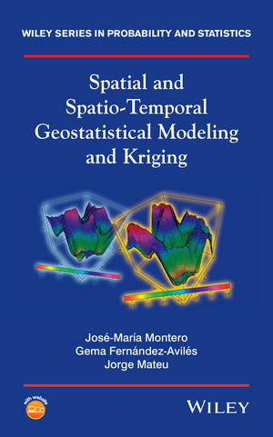

------------------------------------------------------------------------

-   [**Investigación**]{style="color:blue"}

    -   Estadística espacial y espacio-temporal.

    {width="150"}
------------------------------------------------------------------------


---
## Análisis de datos espaaciales ne R

<center> </center>
Source: Chicaiza (2016)

---

# Pasos de un análisis geoesdadístico con geoR

1. Leemos los datos y las coordenadas donde se han medido y creamos un objeto de la clase as.geodata (`geoR`)

2. ¿Existe algún tipo de dependencia espacial? Análisis exploratorio de datos espaciales

3. ¿Cómo es la estructura de la dependencia espacial? Semivariograma empirico

4. ¿Es mi semivariograma válido? Ajuste del semivariograma empírico al semivariograma teórico

5. ¿Puedo hacer predicciones en sitios donde no tenga datos de la variable que analizo? Kriging

6. ¿Cómo son las predicciones? Desviación típica del error de predicción

7. Evaluación y presentación de resultados. Mapping


---

graphical abstactr


---

# Thomas Jefferson {.background-color: "orange"}

<q>_Never put 'till tomorrow what you can do today_</q>


---

## Kriging interpolation of CO in Madrid with R


---

### Step 1. Lectura de datos y creacion del objeto as.geodata()


```r
# lectura de geoR. Instalar si no lo tengo
library(geoR)

# lectura de los datos
data.co=read.table("data/Madrid_LOG_co50s10h.txt", header=TRUE)
estaciones <- read.table("data/coordata.txt", header = FALSE)
MuniMadrid <- matrix(scan("data/MuniMadrid.txt"), ncol = 2, byrow = T)

# creamos una malla de interopolación
loci <- expand.grid(seq(min(MuniMadrid[, 1]), max(MuniMadrid[, 1]), l = 51), 
                    seq(min(MuniMadrid[, 2]), max(MuniMadrid[, 2]), l = 51))


# creación del objeto as.geodata()
co.50s.10h<-as.geodata(obj=data.co, coords.col = 1:2, data.col = 3)
```

---

### Step 2. Análisis exploratorio de datos espaciales

 

```r
# descriptivos 
summary(co.50s.10h)
```

```
## Number of data points: 23 
## 
## Coordinates summary
##            x       y
## min 436436.6 4470109
## max 448850.0 4481161
## 
## Distance summary
##        min        max 
##   820.6698 14355.1451 
## 
## Data summary
##       Min.    1st Qu.     Median       Mean    3rd Qu.       Max. 
## 0.07696104 0.69303467 0.95165788 0.88895821 1.03302615 1.61541998
```

```r
# análisis gráfico
plot(co.50s.10h)
```


```r
# Mapa de quintiles
points(co.50s.10h, pch=21, bg=8, lwd=4, cex.max=3, col=cm.colors(12) )
```


---

### Step 3. Point prediction


```r
library(dplyr); library(sf); library(leaflet)

MuniMadrid_sf <- st_as_sf(as.data.frame(MuniMadrid), coords = c("V1","V2"),
                          crs=st_crs(25830)) %>% st_transform(4326)
ha <- st_as_sf(data.co, coords = c("x","y"), crs=st_crs(25830)) %>%  st_transform(4326)
dato= data.co$co
dato <- sprintf("<strong>Level of CO: %s</strong>", round(data.co$co,2)) %>% lapply(htmltools::HTML)
leaflet(ha) %>% addTiles() %>% addMarkers(popup = dato, clusterOptions = markerClusterOptions()) %>%
 addCircleMarkers(radius = 7, color = "red", popup = dato)
```

```{=html}
<div id="htmlwidget-e2ccf2ce979151934d6f" style="width:100%;height:336px;" class="leaflet html-widget"></div>
<script type="application/json" data-for="htmlwidget-e2ccf2ce979151934d6f">{"x":{"options":{"crs":{"crsClass":"L.CRS.EPSG3857","code":null,"proj4def":null,"projectedBounds":null,"options":{}}},"calls":[{"method":"addTiles","args":["//{s}.tile.openstreetmap.org/{z}/{x}/{y}.png",null,null,{"minZoom":0,"maxZoom":18,"tileSize":256,"subdomains":"abc","errorTileUrl":"","tms":false,"noWrap":false,"zoomOffset":0,"zoomReverse":false,"opacity":1,"zIndex":1,"detectRetina":false,"attribution":"&copy; <a href=\"http://openstreetmap.org\">OpenStreetMap<\/a> contributors, <a href=\"http://creativecommons.org/licenses/by-sa/2.0/\">CC-BY-SA<\/a>"}]},{"method":"addMarkers","args":[[40.4232373919687,40.4199734057765,40.4248457631501,40.4789473082719,40.4383767125279,40.4304181593727,40.4222956963889,40.4028201412062,40.445901918285,40.4522437790507,40.4293625716291,40.3888614179574,40.3858168651033,40.4689664775136,40.4407518015941,40.395483800577,40.4085647292214,40.408673098544,40.4417823585764,40.4071369199676,40.4508909970024,40.4207928536065,40.3800028526005],[-3.69194959680356,-3.70323633242671,-3.71212849806534,-3.71155072793823,-3.69092732785467,-3.68031562147272,-3.68235461718952,-3.69356911590012,-3.70650875627907,-3.67730713513549,-3.66857607807552,-3.65154177030991,-3.71673983580238,-3.68868833618176,-3.63927445660114,-3.73189624085894,-3.7419356978541,-3.64529143632041,-3.71836774601774,-3.71280630043627,-3.60442807893329,-3.74926944876749,-3.60258071055856],null,null,null,{"interactive":true,"draggable":false,"keyboard":true,"title":"","alt":"","zIndexOffset":0,"opacity":1,"riseOnHover":false,"riseOffset":250},["<strong>Level of CO: 0.95<\/strong>","<strong>Level of CO: 1.02<\/strong>","<strong>Level of CO: 0.9<\/strong>","<strong>Level of CO: 0.9<\/strong>","<strong>Level of CO: 1.19<\/strong>","<strong>Level of CO: 0.92<\/strong>","<strong>Level of CO: 1.05<\/strong>","<strong>Level of CO: 1.32<\/strong>","<strong>Level of CO: 1.26<\/strong>","<strong>Level of CO: 0.68<\/strong>","<strong>Level of CO: 0.98<\/strong>","<strong>Level of CO: 0.41<\/strong>","<strong>Level of CO: 1.62<\/strong>","<strong>Level of CO: 0.71<\/strong>","<strong>Level of CO: 0.64<\/strong>","<strong>Level of CO: 1.44<\/strong>","<strong>Level of CO: 0.74<\/strong>","<strong>Level of CO: 0.97<\/strong>","<strong>Level of CO: 0.97<\/strong>","<strong>Level of CO: 0.98<\/strong>","<strong>Level of CO: 0.51<\/strong>","<strong>Level of CO: 0.08<\/strong>","<strong>Level of CO: 0.22<\/strong>"],null,{"showCoverageOnHover":true,"zoomToBoundsOnClick":true,"spiderfyOnMaxZoom":true,"removeOutsideVisibleBounds":true,"spiderLegPolylineOptions":{"weight":1.5,"color":"#222","opacity":0.5},"freezeAtZoom":false},null,null,{"interactive":false,"permanent":false,"direction":"auto","opacity":1,"offset":[0,0],"textsize":"10px","textOnly":false,"className":"","sticky":true},null]},{"method":"addCircleMarkers","args":[[40.4232373919687,40.4199734057765,40.4248457631501,40.4789473082719,40.4383767125279,40.4304181593727,40.4222956963889,40.4028201412062,40.445901918285,40.4522437790507,40.4293625716291,40.3888614179574,40.3858168651033,40.4689664775136,40.4407518015941,40.395483800577,40.4085647292214,40.408673098544,40.4417823585764,40.4071369199676,40.4508909970024,40.4207928536065,40.3800028526005],[-3.69194959680356,-3.70323633242671,-3.71212849806534,-3.71155072793823,-3.69092732785467,-3.68031562147272,-3.68235461718952,-3.69356911590012,-3.70650875627907,-3.67730713513549,-3.66857607807552,-3.65154177030991,-3.71673983580238,-3.68868833618176,-3.63927445660114,-3.73189624085894,-3.7419356978541,-3.64529143632041,-3.71836774601774,-3.71280630043627,-3.60442807893329,-3.74926944876749,-3.60258071055856],7,null,null,{"interactive":true,"className":"","stroke":true,"color":"red","weight":5,"opacity":0.5,"fill":true,"fillColor":"red","fillOpacity":0.2},null,null,["<strong>Level of CO: 0.95<\/strong>","<strong>Level of CO: 1.02<\/strong>","<strong>Level of CO: 0.9<\/strong>","<strong>Level of CO: 0.9<\/strong>","<strong>Level of CO: 1.19<\/strong>","<strong>Level of CO: 0.92<\/strong>","<strong>Level of CO: 1.05<\/strong>","<strong>Level of CO: 1.32<\/strong>","<strong>Level of CO: 1.26<\/strong>","<strong>Level of CO: 0.68<\/strong>","<strong>Level of CO: 0.98<\/strong>","<strong>Level of CO: 0.41<\/strong>","<strong>Level of CO: 1.62<\/strong>","<strong>Level of CO: 0.71<\/strong>","<strong>Level of CO: 0.64<\/strong>","<strong>Level of CO: 1.44<\/strong>","<strong>Level of CO: 0.74<\/strong>","<strong>Level of CO: 0.97<\/strong>","<strong>Level of CO: 0.97<\/strong>","<strong>Level of CO: 0.98<\/strong>","<strong>Level of CO: 0.51<\/strong>","<strong>Level of CO: 0.08<\/strong>","<strong>Level of CO: 0.22<\/strong>"],null,null,{"interactive":false,"permanent":false,"direction":"auto","opacity":1,"offset":[0,0],"textsize":"10px","textOnly":false,"className":"","sticky":true},null]}],"limits":{"lat":[40.3800028526005,40.4789473082719],"lng":[-3.74926944876749,-3.60258071055856]}},"evals":[],"jsHooks":[]}</script>
```


---

### Step 4: Compute the empirical semivariogram
#### geoR::variog()


.pull-left[ 

```r
bin1.co.50s.10h <- variog(co.50s.10h, uvec = seq(800, 7000, l = 10), tolerance = pi/8)
```

```
## variog: computing omnidirectional variogram
```

```r
cloud.co.50s.10h <- variog(co.50s.10h, option = "cloud")
```

```
## variog: computing omnidirectional variogram
```
]

.pull-rigth[ 

```r
par(mfrow = c(1, 2))
plot(bin1.co.50s.10h, ylab = "Semivariogram", main = "", col = 1, pch = 21, bg = "darkgray", lwd = 2)
plot(cloud.co.50s.10h, xlim = c(0, 7000), col = "darkgray", main = " ", pch = 16, ylab = " ")
lines(bin1.co.50s.10h, type = "b", pch = 22, bg = 8, lwd = 2, cex = 1.2, ylab = " ")
```


]


---

### Step 5: Compute the theoretical semivariogram (spherical)
##### geoR::variofit() --> OLS, WLS
##### geoR::likfit() --> ME, REML


```r
ols <- variofit(bin1.co.50s.10h, ini = c(0.134, 1800), cov.model = "spherical", 
    fix.nugget = FALSE, weights = "equal")
```

```
## variofit: covariance model used is spherical 
## variofit: weights used: equal 
## variofit: minimisation function used: optim
```

```r
ml <- likfit(co.50s.10h, coords = co.50s.10h$coords, data = co.50s.10h$data, 
    cov.model = "spherical", ini = c(0.134, 1800), nugget = FALSE, fix.psiA = FALSE, 
    fix.psiR = FALSE, lik.method = "ML")
```

```
## kappa not used for the spherical correlation function
## ---------------------------------------------------------------
## likfit: likelihood maximisation using the function optim.
## likfit: Use control() to pass additional
##          arguments for the maximisation function.
##         For further details see documentation for optim.
## likfit: It is highly advisable to run this function several
##         times with different initial values for the parameters.
## likfit: WARNING: This step can be time demanding!
## ---------------------------------------------------------------
## likfit: end of numerical maximisation.
```

```r
wls <- variofit(bin1.co.50s.10h, ini = c(0.134, 1800), cov.model = "spherical", 
    fix.nugget = FALSE, weights = "npairs")
```

```
## variofit: covariance model used is spherical 
## variofit: weights used: npairs 
## variofit: minimisation function used: optim
```

```r
reml <- likfit(co.50s.10h, coords = co.50s.10h$coords, data = co.50s.10h$data, 
    cov.model = "spherical", ini = c(0.134, 1800), fix.psiA = FALSE, fix.psiR = FALSE, 
    fix.nugget = FALSE, lik.method = "RML")
```

```
## kappa not used for the spherical correlation function
## ---------------------------------------------------------------
## likfit: likelihood maximisation using the function optim.
## likfit: Use control() to pass additional
##          arguments for the maximisation function.
##         For further details see documentation for optim.
## likfit: It is highly advisable to run this function several
##         times with different initial values for the parameters.
## likfit: WARNING: This step can be time demanding!
## ---------------------------------------------------------------
## likfit: end of numerical maximisation.
```
---

### Step 6: Plot both (empirical and theoretical) semivariograms

```r
plot(bin1.co.50s.10h, ylab = "Semivariogram", main = " ", col = 1, pch = 21, bg = "yellow", lwd = 2, cex = 1.2)
lines(ols, lwd = 2, lty = 3); lines(wls, lwd = 2, lty = 1); lines(ml, lwd = 1, lty = 1);lines(reml, lwd = 2, lty = 2)
legend(0.55, 0.17, legend = c("OLS", "WLS", "ML", "REML"), lty = c(3, 1, 1, 
    2), lwd = c(2, 2, 1, 2), cex = 0.7)
```


---

### Step 7: Compute Ordinary Kriging
##### geoR::krige.conv() 

```r
kc.co.2s.10h <- krige.conv(co.50s.10h, coords = co.50s.10h$coords, data = co.50s.10h$data, 
    loc = loci, krige = krige.control(cov.model = "spherical", cov.pars = c(0.1403, 6096.4841), nugget = 0))
```

```
## krige.conv: model with constant mean
## krige.conv: Kriging performed using global neighbourhood
```

```r
str(kc.co.2s.10h)
```

```
## List of 6
##  $ predict     : num [1:2601] 0.738 0.738 0.738 0.738 0.738 ...
##  $ krige.var   : num [1:2601] 0.159 0.159 0.159 0.159 0.159 ...
##  $ beta.est    : Named num 0.738
##   ..- attr(*, "names")= chr "beta"
##  $ distribution: chr "normal"
##  $ message     : chr "krige.conv: Kriging performed using global neighbourhood"
##  $ call        : language krige.conv(geodata = co.50s.10h, coords = co.50s.10h$coords, data = co.50s.10h$data,      locations = loci, krige| __truncated__ ...
##  - attr(*, "sp.dim")= chr "2d"
##  - attr(*, "prediction.locations")= symbol loci
##  - attr(*, "parent.env")=<environment: R_GlobalEnv> 
##  - attr(*, "data.locations")= language co.50s.10h$coords
##  - attr(*, "class")= chr "kriging"
```

---
 
### Step 8: Prediction and SD maps


<center> 


</center>


---
### Step 10: Comment the results


```{=html}
<div id="htmlwidget-70187ed585685848be92" style="width:100%;height:480px;" class="leaflet html-widget"></div>
<script type="application/json" data-for="htmlwidget-70187ed585685848be92">{"x":{"options":{"crs":{"crsClass":"L.CRS.EPSG3857","code":null,"proj4def":null,"projectedBounds":null,"options":{}}},"calls":[{"method":"addTiles","args":["https://www.ign.es/wmts/pnoa-ma?service=WMTS&request=GetTile&version=1.0.0&Format=image/png&layer=OI.OrthoimageCoverage&style=default&tilematrixset=GoogleMapsCompatible&TileMatrix={z}&TileRow={y}&TileCol={x}",null,"Terreno",{"minZoom":"4","maxZoom":18,"tileSize":256,"subdomains":"abc","errorTileUrl":"","tms":false,"noWrap":false,"zoomOffset":0,"zoomReverse":false,"opacity":1,"zIndex":1,"detectRetina":false,"attribution":"<a href='http://www.ign.es/'>Infraestructura de Datos Espaciales de Espa&ntilde;a (IDEE)<\/a>"}]},{"method":"addTiles","args":["//{s}.tile.openstreetmap.org/{z}/{x}/{y}.png",null,"Callejero",{"minZoom":0,"maxZoom":18,"tileSize":256,"subdomains":"abc","errorTileUrl":"","tms":false,"noWrap":false,"zoomOffset":0,"zoomReverse":false,"opacity":1,"zIndex":1,"detectRetina":false,"attribution":"&copy; <a href=\"http://openstreetmap.org\">OpenStreetMap<\/a> contributors, <a href=\"http://creativecommons.org/licenses/by-sa/2.0/\">CC-BY-SA<\/a>"}]},{"method":"addProviderTiles","args":["Stamen.TonerLines",null,"Carreteras",{"errorTileUrl":"","noWrap":false,"detectRetina":false}]},{"method":"addRasterImage","args":["data:image/png;base64,iVBORw0KGgoAAAANSUhEUgAAAD0AAAA/CAYAAABTqsDiAAAJH0lEQVRoge2aW4scxxXHf6equrp7bnuxJNuyrRgT/BKStzwaf4KEEAQxgXwBvwbyIfKSfIE85AIRRg7k4he/hjwFTG4QEgeDrciWY2svMzszfas6eajelSWvVreZ1YL0h2bYnenu+tf5n0udKlFVnjSYxz2Ax4GnpJ8UPCX9pOAp6bOAjy6/oR9dfmOteVTOUp4+juylq1dk1e85c5a+E+uw+pknvQ6cGdInWXTV1n5k0qsY0P08Y5XE3aPcfDiQOwf0IMFn3ZH6ODxU9H6QgZ40AQ9DeBXR/K6WXpUFDp+zjtTzsHgkeT8ITprEOydk3ZI/NdJ3w3EKuHT1inyR+KpVclefPs0Ac9rSPzN5+jRxJkifdtq6K+nTltxpEj/R0peuXpGzlGpWhTMh79PG6aSsI+EeJxq9+1drwvotrYKqoNEQoyEG218GjQZVAwjo6fn1+kgriXAUNPZEuzsJyy0VCAjKtcvfWzvx+15wPJAVFOCWdfXwOlSyKGIixsb0aSJIRETTfYcTdofm71Wu3m/QXc8qq5d0DAYNlhhtsrgKCBgTMbbDZh3WdRjbISYe3XvbRCE9db3l94eTesyr74f46uWtoEov60M/NoTOpau1hM4CgrEB5yt8uSAfHJAPDsjKBVleYbMW4wLGBMQExEaM6f+2Mf1P4peo348i1xS9++ClhhgTyS4YQhBAsDZJ2fkaYyPOVzi/BKcQIHQ5ocnp2pzYOVSll35CigVC1KQGooCaYy1/HNaYslIQC62l6a+2S8RFlGEw2KzDDxbJankEH8GAC0tsXeFqT9fkaHC9zBU9nNBgkWiT+4glBpD7JL7WPB1jsnDdWBaVY1lZus7gbPLfwheUE5t+bBTJFHzyXSkEqWtM1aCtTRYF6NUTgyN2GUEcBEAhxqSAjy6/oSf59kpJC4pYBQkYE9FoaGtHCMKysswqoQ4RI0KIniyLlIshxWiK0woMiFNwEbyAj4g3aBt7CQMRTCvENiNIvPXmKIgeyvxk4isjbUzEuBbnG6xtUTW4qiQGg6syAJqozFqljZF5J8RY4l3EDxb4wYyUsTSFVxMRK8nPu2TBQ9LUBrts+yyRgqUYi0SDCtxL4w9F+rh86XyNL+f4wRQpIwgUc4vYQNd4lrXloMoIGtntAjud0gTwN0vGkw3KyS5+MUsPzGOSuvRSdwom9oEupT0NgmlbxPiU96X/PSnXr13el65ekRs/+Lbmm/vIVoeMO8giVJbx59dxWYOYl+i6MfuNYdHV7NNQdwG/X1B+sgG8zPjc5xSjPdywQovYkwWMglOEXs6PWKevTN7P/fJ3Mv/RNxVRzAsDpBxAjMj5HYaTT7BZQ+heZb6YsN/maFSWBG5UHaObHpENNucFo8k25XhKPprifJUiuwtIpmieYoZ2Aq0QgzsqZ1VvzcS9CpSVBrLhj/8sAM2fvqOy+QziSzjYRccfkusOW/NPuDDPWLQF2bJgEZTCCUZgdpDRNJaDhWc0HTAcb+CLJcZ12KzFZQ0uX+B81cvbEjp/2/tfuPL2fWlgPSlrNMGe/wpm6zm0XtAC5rP3KMe7jIbPszn0dGqZRMX2w5w3sGgMyyqnqi3LylEWA3wWyPKarKjwZU6Wp4kACJ3j3M/efWCxr5x08/vXlIsvQujAZYgWECNaG0KXp+qq/60CdYBFF8mMkFtBOyUcONrW0HYtg1IoAWMDIWsxNks+LTFF9IfAykn7b/1Rmnde1265hOv/huke4V/XqP/+DDv/vcT0wKec3QamTaRTyK0wzqDoFxdtVKQ2eG8QAZd1uKImy2usbzCmQ0SJcvfcdFKeXstJhOVPvqEI6MLSXh/yvw9e5eMbE27ue5adMmsjHzctn7LEIjyvAy6WjmdyQ5H3dblVNsYNW9sHDDd3yYdTsmKe0pYAEbSzdE1BVw/ompzQOjTa29L0ccTX4tPLf56nWYyYfnae6zfGvP+Z4T/1kh1mKBBQFnRU0rKpBQYYOWF7s2FrUlMOK3y5pBjNKMc7mI0GGUYkS/mfIGgjaBXJ5pGjBU4Ugpoj2a+0IjtpU+7D735f6/kr7E9zPv285P29wF/jLv+Q6+zFPQRDLiUTKdlmxJiMTW/ZHkWeOzfn3MsfUFzcRUYhlaFlgFIQn4P1fXxYInNBZ45oIIsLYufSFS0Ee2JRtpL9aSEt97rGU80nTA88N/dyrh9ErseKGzJjL+6xV19j1u6wmV9A/Fd5lk22yNnODVsbSybPfkrx8g72FUUmW2AtZBm4DDIPmYMQkNkU3fkctEYaA8uIrVuCDdCmsa29IktdEktoHU1rqGrLvIFlUDoiDkMhA4psjBFD7saMpGBLC7ZNxkahjAYtxXCaLOtLGI6gKBJhl2HyIWYwQWNHMNeQ5QLNlohT1Kb2E6L4YsGFn7+z+uLkcBZvdSk0dTFsxBjFWMWJ4I0wDhnndUiQc4xcSes6RhS8oNu8pEMulIaNcUsxPsDli1RyhgBtmwiLAWPQriEup2hbQ1WhbZt8O9J3a+SeC41HIv0lCIhRXNZSFJZRMLStoVMLePLGsk3Bgk0iUGA5pwUXS8f5kTIZNeTlol9RGXRxANYiTd1b2qG299O6Rg+m6P4+uvBQGbQxxJCo3MvKj0z6tn1kUYwNAIyGDSKQZRnDWcbuzZjWDQhfz8ZkBobOsDVQtiYN5aDCZg1EQRcGdj1UM9TvgxOwLvVNYoA2oJWFRY7OLTq3hLogtB7j2vsa98ry9J3FwF9ee1Nnc89r7/30tpl/92s/VGsUn0XKomNYtgw2ZhTjKflghiuWfeuo76RYTZI/XCcHgU7QxqBLIVQlbZXytJjAs7/4wz0tferHJP/2+psqolijWBdwviXLa1xeY7MGYwPGdBgbkMNPCYg5XCuTGgddRuh830D0IMrzv/rtY1xwnIDheEEKfHqr0Y8S2ozY2SNy6fs+QJrUfjrsjR9tEwVHDJaLv/7NAxXhp07a+RoAORpmkm5aE1tu7xOkbkgi33dH0KMWsKrhxbfeevyrrHtBhL6tczJS0ydJWUN/7xc2vpSHPzhw6qQvvf1rudsuxN1IHP7+zr2th8VjOVK1itMNj/KMM3XI/bTwRB6/eEr6ScFT0k8K/g9Vf+PFKIt1xgAAAABJRU5ErkJggg==",[[40.6894608154534,-3.92938954851796],[40.2711408154534,-3.47920954851796]],0.7,null,null,"Predicción"]},{"method":"addPolygons","args":[[[[{"lng":[-3.6364544,-3.6547903,-3.6611691,-3.6680685,-3.6667366,-3.6859865,-3.6965966,-3.7112007,-3.734655,-3.7411915,-3.7784959,-3.8034784,-3.8001447,-3.8103799,-3.8067843,-3.8145803,-3.8416811,-3.8586686,-3.8682471,-3.8837333,-3.889091,-3.8850868,-3.8738541,-3.8539888,-3.8530823,-3.836604,-3.8367582,-3.8343618,-3.8025217,-3.792942,-3.7901775,-3.7708828,-3.7707861,-3.780471,-3.7743171,-3.7814142,-3.8030936,-3.8347724,-3.8106378,-3.8070071,-3.7879178,-3.7805113,-3.7578471,-3.7211679,-3.7251849,-3.7126157,-3.6934448,-3.6489686,-3.6108205,-3.5762257,-3.5848024,-3.5533734,-3.5426495,-3.5292118,-3.5209375,-3.5195182,-3.5311901,-3.5306078,-3.5397311,-3.5776408,-3.5791373,-3.5737689,-3.5634061,-3.5311884,-3.5342949,-3.5271455,-3.5258329,-3.5340253,-3.5416212,-3.5539637,-3.554332,-3.5715559,-3.5933979,-3.6031334,-3.6148475,-3.6446452,-3.6586819,-3.667046,-3.6780903,-3.6697636,-3.6883876,-3.7006625,-3.6742753,-3.6614527,-3.6497739,-3.6255155,-3.6020111,-3.6263642,-3.6364544],"lat":[40.6361462,40.6429036,40.6404034,40.6295714,40.6199308,40.6075033,40.5899901,40.5831085,40.5852409,40.5907755,40.6017549,40.6015837,40.6053815,40.6092199,40.6015607,40.5949567,40.5923031,40.5881241,40.5923226,40.5855388,40.5707326,40.5609258,40.5573268,40.5248999,40.5111323,40.5062979,40.4750184,40.4644143,40.4619912,40.4537601,40.4422658,40.4439546,40.4293068,40.4216743,40.4020672,40.3941728,40.3921053,40.3961196,40.3638906,40.3665917,40.3587413,40.3618907,40.3572576,40.3654021,40.3346922,40.3238604,40.3207426,40.3333611,40.3144335,40.3151516,40.3216312,40.3559393,40.3931614,40.389476,40.3921172,40.4098082,40.4200842,40.4146715,40.4110366,40.413663,40.4331566,40.4377048,40.4364224,40.4466785,40.4526775,40.4538455,40.4700135,40.4722461,40.4941384,40.501224,40.5115553,40.5132642,40.5017939,40.5016805,40.5114654,40.5083931,40.5123229,40.5249684,40.5267148,40.534682,40.5696346,40.5787407,40.5889604,40.5924397,40.5774706,40.5734244,40.5912334,40.6175444,40.6361462]}]]],null,null,{"interactive":true,"className":"","stroke":true,"color":"#03F","weight":5,"opacity":0.5,"fill":false,"fillColor":"#03F","fillOpacity":0.2,"smoothFactor":1,"noClip":false},null,null,null,{"interactive":false,"permanent":false,"direction":"auto","opacity":1,"offset":[0,0],"textsize":"10px","textOnly":false,"className":"","sticky":true},null]},{"method":"addLayersControl","args":[["Carreteras","Terreno","Callejero"],"Predicción",{"collapsed":true,"autoZIndex":true,"position":"topright"}]},{"method":"addLegend","args":[{"colors":["#FFFE9E , #FFF591 2.10305778020699%, #F9B842 16.4236029874169%, #F47A32 30.7441481946269%, #D54167 45.0646934018368%, #A21C73 59.3852386090467%, #671264 73.7057838162567%, #2B1240 88.0263290234666%, #040404 "],"labels":["0.2","0.4","0.6","0.8","1.0","1.2","1.4"],"na_color":null,"na_label":"NA","opacity":0.5,"position":"topright","type":"numeric","title":"CO (ln)","extra":{"p_1":0.0210305778020699,"p_n":0.880263290234666},"layerId":null,"className":"info legend","group":null}]}],"limits":{"lat":[40.2711408154534,40.6894608154534],"lng":[-3.92938954851796,-3.47920954851796]}},"evals":[],"jsHooks":[]}</script>
```

#### Acknowledgments: To **Diego Hernangómez Herrero** for his valuable comments and his support and advice in the plotting phase.

---
# References

<center></center>

---
# R libraries

Cheng, J., Karambelkar, B. and Xie, Y. (2021). leaflet: Create Interactive Web Maps with
  the JavaScript 'Leaflet' Library. R package version 2.0.4.1.
  https://CRAN.R-project.org/package=leaflet
  
Hernangómez, D. (2021). mapSpain: Administrative Boundaries of Spain. R package version 0.2.3.
  http://doi.org/10.5281/zenodo.4318024. Package url: https://CRAN.R-project.org/package=mapSpain

Pebesma, E. (2004). Multivariable geostatistics in S: the gstat package. Computers &
  Geosciences, 30: 683-691.

Gräler, B., Pebesma. E. and Heuvelink, G. (2016). Spatio-Temporal Interpolation using
  gstat.  The R Journal 8(1), 204-218
  
Pizarro, M. (2020). climaemet (R Climate AEMET Tools).
  https://CRAN.R-project.org/package=climaemet.

Ribeiro, P., Diggle, P., Schlather, M., Bivand, R. and Ripley, R. (2020).
  geoR: Analysis of Geostatistical Data. R package version 1.8-1.
  https://CRAN.R-project.org/package=geoR


---


### Brief technical notes
Predict the value $Z^\ast (\bf s)$ at the location $\bf s_0$ by 
$Z^\ast ({\bf s}_0) = \sum\limits_{i = 1}^n {\lambda _i Z(\bf s_i )}$
based on the given values
$Z_{\bf s_1},Z_{\bf s_2},\ldots,Z_{\bf s_n}$.


The **Kriging weights** $\lambda_1,\ldots,\lambda_n$ are determined so that
the expected squared interpolation error
\begin{equation*}
E((Z^\ast ({\bf s_0})- Z({\bf s_0}))^2) \quad **.red[simple]**  DEPENDS\ ON  \ SEMIVARIOGRAM !!
\end{equation*}
is minimized over all choices of $\lambda_1,\ldots,\lambda_N$.


#### **Ordinary Kriging**:
\begin{equation*}
\left\{ {\begin{array}{l}
 \sum\limits_{j = 1}^n {\lambda _j \gamma ({\bf s}_i - {\bf s}_j) + \alpha = 
 \gamma ({\rm {\bf s}}_i - {\bf s}_0 ),\forall i = 1,...,n} \\
 \sum\limits_{i = 1}^n {\lambda _i = 1} \; \\
   \end{array}} \right.
\end{equation*}

#### **Semivariogram**: $\gamma ({\rm{\bf h}}) = \frac{1}{2}V\left[ {Z({\bf s} + {\bf h}) - Z({\bf s})}\right]     ***** key *** !!$


---

# Questions?

gema.faviles@uclm.es
---
